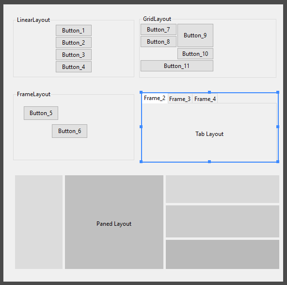

## Introduction

* **Formation** is a design tool intended  to make the work of tkinter UI designers easy
by providing an intuitive drag drop interface. It allows designers to employ all layout managers (Pack, Place and Grid) 
to flexibly achieve various design goals. For ease of implementation the designer itself is written in what we like to
call contemporary tkinter provided by the [hoverset library](../hoverset). The supported widgets have been organised into families of 
widgets referred to here as _widget sets_ and include:
   * [Tkinter](https://docs.python.org/3/library/tkinter.html) default (Legacy)
   * [Tkinter ttk](https://docs.python.org/3/library/tkinter.ttk.html) extension (Native implementations of tkinter widgets)
   * [Tix extension](https://docs.python.org/3/library/tkinter.tix.html) set (Incomplete)
   * Hoverset widget set (Incomplete)

### Features

* **Drag drop designer**: Formation provides an easy to use drag drop designer. The designer can be expanded to full 
screen display to allow focus on design. The designer allows widgets to be moved from parent to parent as needed to 
simplify the design process. The designer supports manipulation using the following layout strategies:
   - LinearLayout (Pack)
   - GridLayout (Grid)
   - FrameLayout (Place)
   - TabLayout (for `Tkinter.ttk.Notebook`)
   - PaneLayout (for PanedWindows)

* **Component library**
The component library allows designers to search through the supported widget sets and add them to the designer. They 
can filter the components based on their widget sets.

* **Component Tree**
Display the Widget hierarchy and select widgets that may be (due to design) difficult to access directly from the design
pane. Access the context menu of the widget from the component tree which is basically just an extension/handle of the 
widget. 

* **Style pane**
Access the style and layout attributes of selected widgets. The layout attributes automatically switch to match the 
layout manager currently handling the widget. Easily manage a wide range of properties using intuitive editors such as:
   - Color: Modify color in RGB, HSL and HSV and hex notation as well as pick colors from anywhere on your computer 
   screen even outside formation itself
   - Anchor: Intuitively set anchors as well as sticky attributes
   - Text: Write out text values with ease
   - Choice: Get all options valid for a given property
   - Dimensions: Handles all tkinter dimension notations
   - Boolean: Toggle between boolean attributes with a click
   
* **Menu editor**
Create and edit menus using easy to use drag and drop gestures. Access all attributes applicable to the various types 
of menu items and preview the modified menu with the click of a button.

* **Variable manager**
Create tkinter control variables, access and assign them to widgets in the designer. Modify the values of the variables 
on the fly from the manager window. Any control variables added from the manager immediately reflect in the style pane 
allowing the designer to assign them to as many widgets as they desire. Control variables provide an elegant way to
set values to connected widgets which rely on the same value.

* **Floating windows**
All feature windows in formation studio can be opened in window mode allowing only the drag drop designer to cover the
 entire application screen. These windows can turn almost transparent to allow the designer to remain visible under them
 when their are in active. They can be closed and restored at will.
 
 ## Notes for developers and contributors
 
 ### Structure
 * [**Feature**](./feature) : Contains implementation of the various key components of the designer such as:
    - [Component tree](./feature/component_tree.py)
    - [Designer](./feature/design.py)
    - Component library ([Components](./feature/components.py))
    - [style pane](./feature/stylepane.py)
    - [Variable manager](./feature/stylepane.py)
 These components all implement `BaseFeature` defined in [_base](./feature/_base.py) which abstracts all Feature behaviour
 and manipulation which can then be built upon if special behaviour is needed. It contains methods that
 are to be overridden so as to handle events broadcast by the main application such as change in widget
 selection or deletion of a widget among others.
 
 * [**Lib**](./lib) :  Contains implementation of widget sets, complete definitions of their properties, behaviour. It also
 has implementation for the various layouts used by the designer. Definitions and implementation of menus and properties
 that can be applied to the menu components can also be found here. The files under this folder are:
    - [Layouts](./lib/layouts.py): layout implementation
    - [Legacy](./lib/legacy.py): original tkinter widget definition
    - [Native](./lib/native.py): ttk widget extension widgets
    - [properties](./lib/properties.py): definition for all widget properties modifiable by the style pane.
    - [pseudo](./lib/pseudo.py): Base classes for widgets used in the studio designer with added functionality to allow for easy
    manipulation. Definition for container widgets can also be found here
    
* [**Ui**](./ui): Contain implementation of widgets and user interface components used in the studio. The included are:
    - [editors](./ui/editors.py): The ui elements used to modify various widget properties as explained in the style pane feature
    - [geometry](./ui/geometry.py): Access, analyse and manipulate position and sizes of widgets used by various studio routines
    - [highlight](./ui/highlight.py): Transient widgets used to guide designers to which widgets currently have focus. Also contains 
    implementations for resizing and moving widgets in the designer
    - [tree](./ui/tree.py): Implementation of base class for the tree view widgets used in the studio which allows easy manipulation
    using drag drop gestures
    - [widgets](./ui/widgets.py):  Assortment of special widgets used in the studio
   